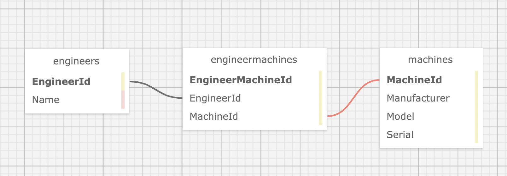

# Factory Work Orders

#### By Kirsten Opstad

#### An application to keep track of machine repairs for a fictional factory

## Technologies Used

* C#
* .Net 6
* ASP.Net Core 6 MVC
* EF Core 6
* SQL
* MySQL
* LINQ

## Description

An MVC web application to manage  engineers and the machines they are licensed to fix. A factory manager should be able to add a list of engineers, a list of machines, and specify which engineers are licensed to repair which machines. An engineer can be licensed to repair many machines and a machine can have many engineers licensed to repair it.

A demonstration of understanding of relational databases and many-to-many relationships using a code-first approach.

### Database Schema


### Objectives (MVP)

#### User Stories
* As the factory manager, I need to be able to see a list of all engineers, and I need to be able to see a list of all machines.
* As the factory manager, I need to be able to select a engineer, see their details, and see a list of all machines that engineer is licensed to repair. I also need to be able to select a machine, see its details, and see a list of all engineers licensed to repair it.
* As the factory manager, I need to add new engineers to our system when they are hired. I also need to add new machines to our system when they are installed.
* I should not be able to create an engineer or a machine if the form's fields are empty or contain invalid values.
* As the factory manager, I should be able to add new machines even if no engineers are employed. I should also be able to add new engineers even if no machines are installed.
* As the factory manager, I need to be able to add or remove machines that a specific engineer is licensed to repair. I also need to be able to modify this relationship from the other side, and add or remove engineers from a specific machine.
* I should not be able to add a machine to an engineer if there are no machines. Likewise I should not be able to add an engineer to a machine if there are no engineers.
* When I access the application, I should see a splash page that lists all engineers and machines.

Additionally, this code will be reviewed for the following objectives:

- Does at least one of your classes have all CRUD methods implemented in your app?
- Are you able to view both sides of the many-many relationship? For a particular instance of a class, are you able to view all of the instances of the other class that are related to it?
- Build files and sensitive information are included in .gitignore file and is not to be tracked by Git, and includes instructions on how to create the appsettings.json and set up the project.
- Project is in a polished, portfolio-quality state.
- The prompt’s required functionality and baseline project requirements are in place by the deadline.

<!--  -->

<!-- [Link to operational site](http://www.kirstenopstad.github.com/<REPOSITORY NAME>) -->

### Goals
1. Meet MVP as described by user stories.
2. Add all CRUD methods to both classes.
3. Add properties to specify if a machine is operational, malfunctioning, or in the process of being repaired.
4. Add properties to specify if an engineer is idle, or actively working on repairs.
5. Add inspection dates to the machines, or dates of license renewal to the engineers.
6. Add a table for incidents, showing which engineer repaired which machine.
7. Add a table for locations, and specify which engineers or machines are located at which factory.
8. Add styling to give life to the project.

## Setup/Installation Requirements

1. Navigate to the `Factory` directory.
2. Create a file named `appsettings.json` with the following code. Be sure to update the Default Connection to your MySQL credentials.
```
{
  "ConnectionStrings": {
    "DefaultConnection": "Server=localhost;Port=3306;database=factory;uid=[YOUR-USERNAME-HERE];pwd=[YOUR-PASSWORD-HERE];"
  }
}
```
3. Install dependencies within the `Factory` directory
```
$ dotnet restore
```
4. To build a local database
```
$ dotnet ef database update
```
6. To build & run program in development mode 
 ```
 $ dotnet run
 ```
7. To build & run program in production mode 
 ```
 dotnet run --launch-profile "production"
 ```

## Known Bugs

* No known bugs. If you find one, please email me at kirsten.opstad@gmail.com with the subject **[_Repo Name_] Bug** and include:
  * BUG: _A brief description of the bug_
  * FIX: _Suggestion for solution (if you have one!)_
  * If you'd like to be credited, please also include your **_github user profile link_**

## License

MIT License

Copyright (c) 2022 Kirsten Opstad 

Permission is hereby granted, free of charge, to any person obtaining a copy of this software and associated documentation files (the "Software"), to deal in the Software without restriction, including without limitation the rights to use, copy, modify, merge, publish, distribute, sublicense, and/or sell copies of the Software, and to permit persons to whom the Software is furnished to do so, subject to the following conditions:

The above copyright notice and this permission notice shall be included in all copies or substantial portions of the Software.

THE SOFTWARE IS PROVIDED "AS IS", WITHOUT WARRANTY OF ANY KIND, EXPRESS OR IMPLIED, INCLUDING BUT NOT LIMITED TO THE WARRANTIES OF MERCHANTABILITY, FITNESS FOR A PARTICULAR PURPOSE AND NONINFRINGEMENT. IN NO EVENT SHALL THE AUTHORS OR COPYRIGHT HOLDERS BE LIABLE FOR ANY CLAIM, DAMAGES OR OTHER LIABILITY, WHETHER IN AN ACTION OF CONTRACT, TORT OR OTHERWISE, ARISING FROM, OUT OF OR IN CONNECTION WITH THE SOFTWARE OR THE USE OR OTHER DEALINGS IN THE SOFTWARE.
